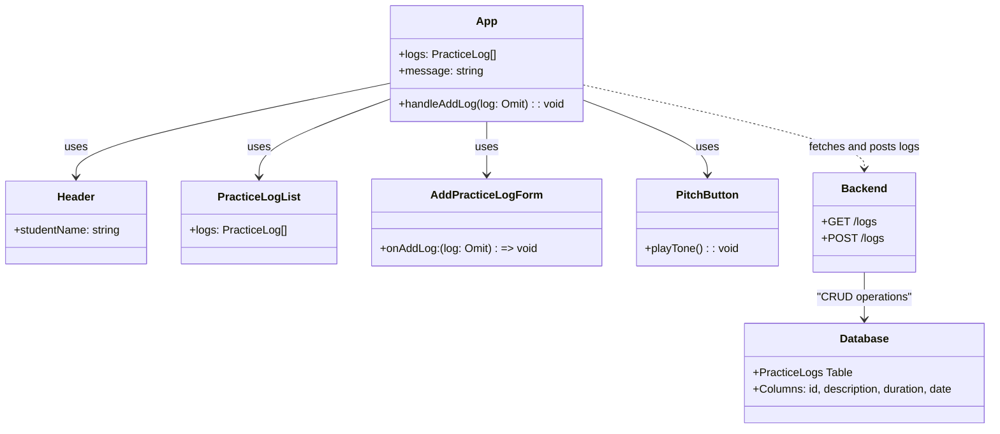

```mermaid
classDiagram
    App --> Header : uses
    App --> PracticeLogList : uses
    App --> AddPracticeLogForm : uses
    App --> PitchButton : uses

    class App {
        +logs: PracticeLog[]
        +message: string
        +handleAddLog(log: Omit<PracticeLog, "id">): void
    }

    class Header {
        +studentName: string
    }

    class PracticeLogList {
        +logs: PracticeLog[]
    }

    class AddPracticeLogForm {
        +onAddLog: (log: Omit<PracticeLog, "id">) => void
    }

    class PitchButton {
        +playTone(): void
    }

    Backend --> Database : "CRUD operations"
    App ..> Backend : fetches and posts logs

    class Backend {
        +GET /logs
        +POST /logs
    }

    class Database {
        +PracticeLogs Table
        +Columns: id, description, duration, date
    }
```
